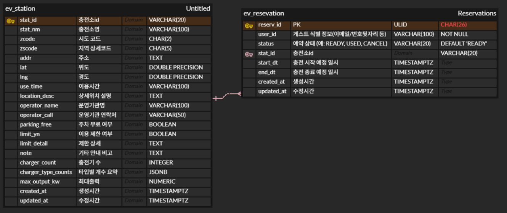

# Watt - Up DB 🔋
본 프로젝트는 **전기차(EV) 충전소 정보 및 예약 시스템** 구축을 목표로 하며, 대규모 데이터 처리와 효율적인 조회를 위해 **CQRS 아키텍처**를 적용했습니다.

* **데이터 원천**: 공공데이터포털의 한국환경공단 전기자동차 충전소 정보 API를 활용하여 약 **12,613건**의 서울시 데이터를 적재했습니다.
* **기술적 특징**:
    * **PostgreSQL (PostGIS)**: 충전소 위치 기반 공간 연산 및 데이터 무결성 보장을 위한 쓰기(Command) 저장소로 사용합니다.
    * **MongoDB**: 고성능 검색 및 유연한 상태 관리를 위한 조회(Query) 저장소로 활용합니다.
    * **FastAPI**: 데이터 수집(Importer) 및 API 서버를 구축하여 컨테이너 환경(Docker)에서 운영합니다.

---

## 📊 Database Schema (ERD)
충전소 정보(`ev_station`)와 예약 정보(`ev_reservation`)를 관리합니다. 특히 `ev_station` 테이블은 PostGIS를 활용하여 공간 쿼리가 가능하도록 설계되었습니다.




## 🏗 Project Structure

```text
ev-stack/
├─ docker-compose.yml     # DB 및 Importer 컨테이너 오케스트레이션
├─ .env                   # 환경 변수 (Git 제외)
├─ schema.sql             # PostGIS 확장 및 테이블 DDL
└─ importer/              # 데이터 수집용 FastAPI 애플리케이션
   ├─ Dockerfile
   ├─ requirements.txt
   └─ app.py
```

### CQRS Pattern

| 구분 | 역할 | 데이터베이스 | 주요 특징 |
| :--- | :--- | :--- | :--- |
| **Command (Write)** | 데이터 생성, 수정, 삭제 | **PostgreSQL (PostGIS)** | 데이터 무결성 보장, PostGIS를 활용한 정교한 공간 연산 및 DDL 관리 |
| **Query (Read)** | 데이터 조회 및 검색 | **MongoDB** | 고성능 문서 기반 조회, 대규모 충전소 상태 데이터의 유연한 스키마 대응 |

- 시스템의 확장성과 조회 성능 최적화를 위해 **CQRS(Command Query Responsibility Segregation)** 패턴을 채택하여 데이터 저장소를 분리 운영합니다. <br><br>


## 🚀 Quick Start
### 1. 환경 설정
`.env` 파일이 필요합니다. 상세 설정값은 [노션 페이지](https://www.notion.so/DB-env-312f3fbbc23f80bda2f4e0c33b51b662?source=copy_link)를 참조하세요.

- **VM IP**: `192.168.200.2` (Cloudjobteam adam)

- **Database DSN**: `postgresql://ev:ev@postgres:5432/ev`

### 2. 컨테이너 실행
```bash
sudo docker-compose up -d --build
```

### 데이터 적재 (Data Import)
FastAPI Importer를 통해 서울시 공공데이터를 DB에 적재합니다. (약 12,000+ 건)
```bash
curl -X POST "[http://127.0.0.1:8000/import/seoul?confirm=true](http://127.0.0.1:8000/import/seoul?confirm=true)"
```

## 🔍 Data Validation
적재된 데이터는 다음 명령어로 확인할 수 있습니다.

### DB 접속:
```bash
docker exec -it ev-postgres psql -U ev -d ev
```

### 주요 확인 쿼리:
```bash
-- 1. 전체 데이터 건수 확인 (정상 적재 시 약 12,613건)
SELECT count(*) FROM ev_station;

-- 2. 구 이름별 충전소 분포 확인
SELECT gu_name, count(*) FROM ev_station GROUP BY gu_name ORDER BY count(*) DESC;

-- 3. PostGIS 공간 데이터 생성 확인
SELECT stat_nm, ST_AsText(geom) FROM ev_station LIMIT 5;
```

## 📝 API Reference (Importer)
- `POST /import/seoul?confirm=true`: 서울시 전기차 충전소 데이터를 fetch하여 PostgreSQL에 `UPSERT` 합니다. 주소에서 `gu_name`을 파싱하여 저장하며, 충전기 타입별 개수를 `jsonb` 형태로 저장합니다.

---

## 🛠 Tech Stack
- **Database**: PostgreSQL 16 (PostGIS), MongoDB 7
- **Language**: Python 3.12 (FastAPI)
- **Infrastructure**: Docker, Docker Compose
- **Data Source**: [공공데이터포털 - 한국환경공단 전기자동차 충전소 정보](https://www.data.go.kr/data/15012845/openapi.do)

<table width="30%" align="center">
    <tr>
        <td align="center"><b>팀원</b></td>
        <td align="center"><b>팀원</b></td>
    </tr>
    <tr>
        <td align="center"></td>
        <td align="center"></td>
    </tr>
    <tr>
        <td align="center"><b><a href="https://github.com/sm4640">임승민</a></b></td>
        <td align="center"><b><a href="https://github.com/Wooniq">한지운</a></b></td>
    </tr>
    <tr>
        <td align="center"><b>DB, CQRS</b></td>
        <td align="center"><b>DB, CQRS</b></td>
    </tr>
</table>